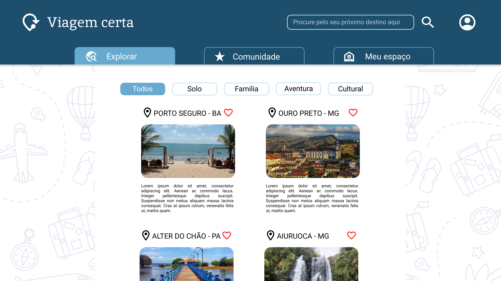

# Projeto de Interface

Conforme detalhado nas especificações, apresentaremos o fluxo do usuário para a plataforma de fórum de viagens. A plataforma foi construída com base em requisitos funcionais e não funcionais, bem como nas histórias de usuário, garantindo que atenda às expectativas dos viajantes. O foco principal é proporcionar uma experiência intuitiva, oferecendo recursos para auxiliar na organização de viagens personalizadas e na resolução de imprevistos durante as viagens. 

## User Flow

## Wireframes

Tela de cadastro 

Nesta tela, o usuário cadastra suas informações pessoais básicas (nome, e-mail e senha) para criar uma conta e acessar a plataforma. 

Home/Explorar 

É a primeira página que o usuário vê ao acessar o site e serve como um guia para o restante do conteúdo, é onde estão localizados a tela de cadastro e todos os postes do fórum após o login, além de contar com os filtros de seleção

Home/Comunidade 

É onde estão localizadas as opções de postar no fórum e parâmetros de viagens, dúvidas, destinos, promoções, dicas, gastronomia, cultura, socializar com outras pessoas em viagens solo, entre outras. 

Home/Meu espaço 

É onde se localizam as postagens salvas e as postagens do usuário logado

